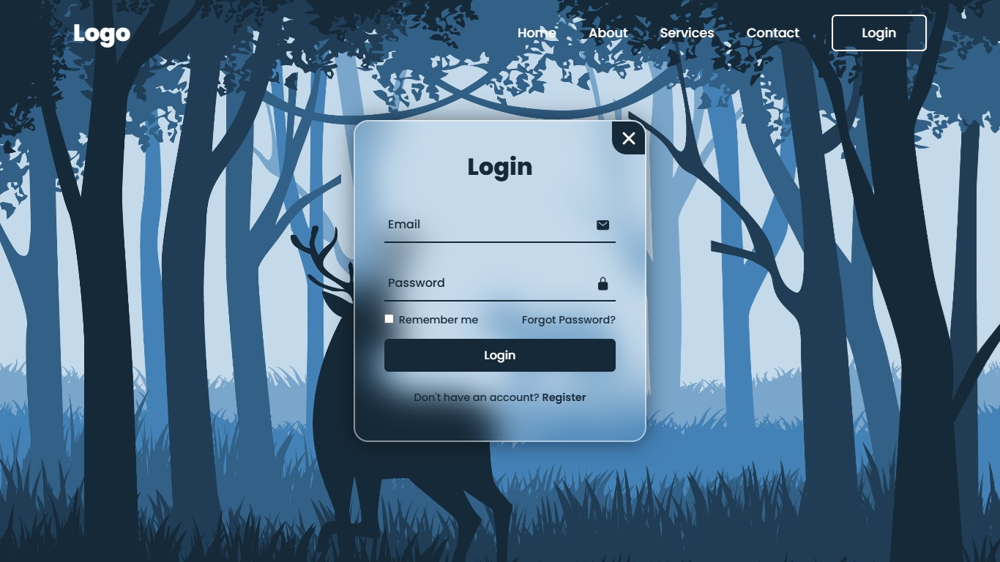
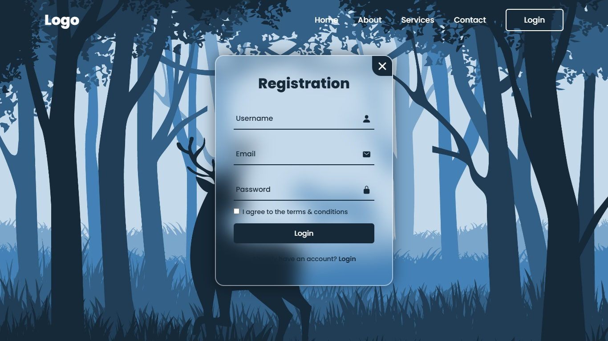

# 🔐 Modern Website With Login And Register

<p align="center">
  
</p>

---

### 🌟 Overview
Welcome to the **Website With Login & Register**! This project showcases a modern, responsive landing page featuring a stunning glassmorphic login and registration modal. It combines the power of **HTML5**, **CSS3**, and **Vanilla JavaScript** to create smooth sliding animations and a seamless user experience.

The beautiful icons used in this project are provided by [Ionicons](https://ionic.io/ionicons).

[📺 Watch Live Demo](https://juniordevelopper.github.io/How-To-Make-A-Website-With-Login-And-Register/)

---

### 🎨 Visual Preview


| 🖼️ Login Interface | 🌀 Registration Form |
| :---: | :---: |
|  |  |
| *Clean glassmorphic login box* | *Smooth slide transition to register* |

---

### 🚀 Key Features
- 💎 **Glassmorphism Design:** Uses advanced CSS `backdrop-filter: blur()` for a beautiful frosted glass effect.
- ⚡ **Interactive Modals:** Smooth popup and slide transitions between Login and Register states using Vanilla JS.
- 🎨 **Dynamic Inputs:** Animated label floating effects when inputs are focused or filled.
- 📱 **Fully Responsive:** Styled with Flexbox and absolute positioning to scale perfectly on centered views.

---

### 📂 File Structure
```bash
project/
├── index.html       # Main HTML structure
├── main.css         # Custom styles, transitions, and root variables
├── main.js          # Modal toggling and class manipulation logic
└── assets/          # Project assets folder
    ├── images/      # Contains background image, screenshots, and the 10s demo gif
    └── icons/       # Local icon files stored for offline usage backup
